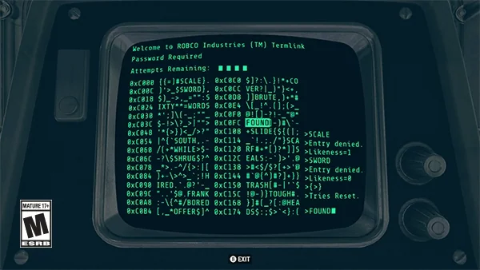
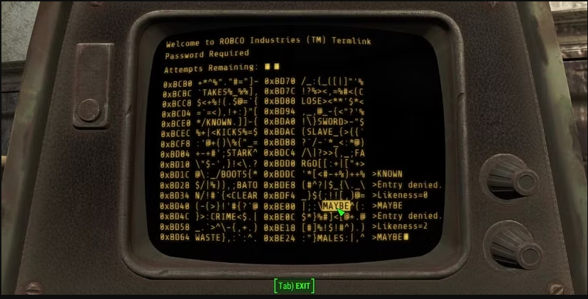
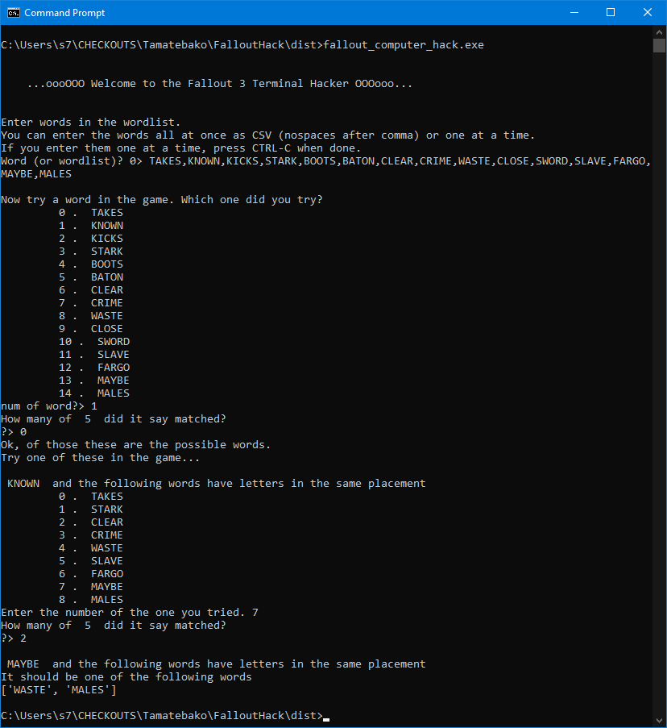
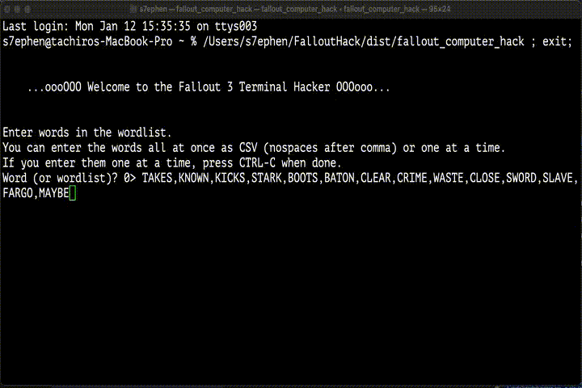
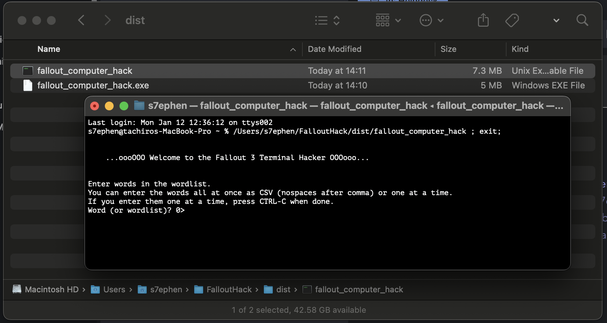

This app will hack any Terminal in Fallout3 in 3 tries. Although it was written for Fallout 3, it also works on the terminals in Fallout 4.

# Download
This Fallout Terminal Hacker was originally written in Python, but there are now binary versions available here:

|OS | File | 
|-|-|
|Windows| [fallout_computer_hack.exe](dist/fallout_computer_hack) [(direct dl)](https://github.com/s7ephen/Tamatebako/raw/refs/heads/master/FalloutHack/dist/fallout_computer_hack) |
|Mac OSX 64bit (Intel)| [fallout_computer_hack](dist/fallout_computer_hack.exe)  [(direct dl)](https://github.com/s7ephen/Tamatebako/raw/refs/heads/master/FalloutHack/dist/fallout_computer_hack.exe)|
|Linux| dawg if you're on linux, you can easily [run the.py](fallout_computer_hack.py) lol|
|Mac OSX (ARM) | Phone CPUs inside Pyewters!? It's unnatural. HERESY! Jesus wept. |

# Background info:
Anyway the Fallout 3 Terminal In-Game thing works like this:
1. you are given a buncha words of equal string length
2. when you guess a word if your guess is not correct the game will tell you how many letters are in the same place in the correct word. EG : If the correct word is "THING" and you guess "BRING" it will report 3/5 because "I", "N", and "G" have the same placement in the main word.
3. You have to make the correct guess within three tries, or the terminal locks you and/or the words change completely.

This fallout hacker will guarantee you find the solution in 3 or less tries.

https://fallout.fandom.com/wiki/Hacking_(Fallout_4)

# Using it
Here is how to use this fallout hacker.

1. If you are given this terminal: 
2. You run the fallout hacker and input the words individually, or all-at-once as a comma-separated entry 

[FalloutTerminalHack_faster.mp4](readme_assets/FalloutTerminalHack_faster.mp4)
 

Works the same on OSX:
 

# Old Readme.txt

This Fallout Hacker was really useful to have on your Android phone (with ASE "Android Scripting Layer") because that way you dont have to open your laptop if you are playing on a gaming console (like I was)

# Note:
now that the "packers" [like pyinstaller](https://github.com/yt-dlp/yt-dlp/blob/master/README.md#compile) have gotten pretty good (and you dont have to fight with py2exe or Swig or Wine for hours) we can have binaries now, so you can ignore the previous sentence I wrote ~15 years go.

This was the first thing i've ever used PyInstaller on. It is surprisingly good. You dont even need to [learn whole languages](https://github.com/s7ephen/seacrane/wiki#why-golang) to avoid C/C++ and get cross-platform binaries out of *single* code-codebase.

These kids are so spoiled. Old man shakes [fist at clouds](https://knowyourmeme.com/memes/old-man-yells-at-cloud). 
